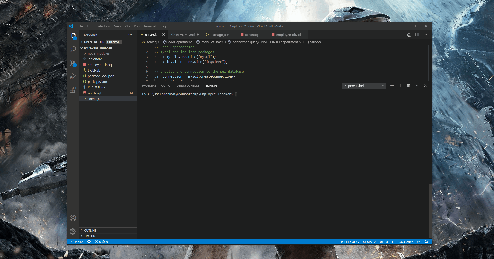

# Employee Tracker

  ## Description
  This project will help businesses track and manage their employees. It allows the user to view departments, roles and employees. Users can also add new departments, roles and emloyees to the database. In addition users can update employee roles as well.

  

  ## Table of Contents
  * [Installation](#installation)
  * [Credits](#credits)
  * [Contributions](#contributions)
  * [Testing](#testing)
  * [Questions](#questions)
  * [License](#license)
   
  ## Installation
    # Required
     * Node
     * mySQL   
    
  1.) Clone the repo from github 
  2.) Pull up the project in your file directory 
  3.) Make sure the password field near the top of the server.js file has your root password for the mySQL server connection. 
  4.) Type "npm i" into the console to install the required modules 
  5.) Enter "node server.js" to run the program 
  6.) Follow the prompts.

  ## Credits
  Jordan Stuckman
  ## Contributions
  Contact me by email or just submit a pull request.
  ## Testing
  Use the provided seed file to test the program after it is installed to ensure it is working properly.
  ## Questions
  If you have any questions or feedback, contact me at jordanks93@gmail.com.
  My github profile is jordanks93.
  ## License
  MIT

